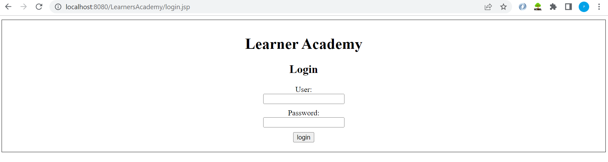
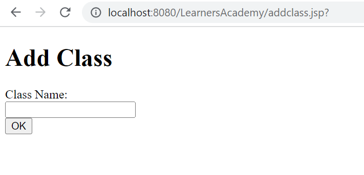
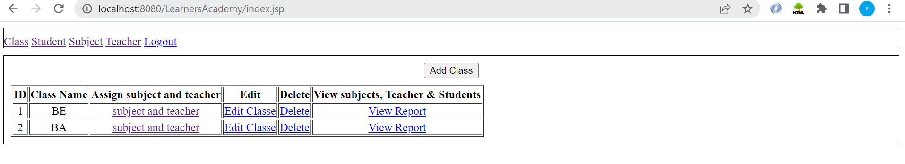
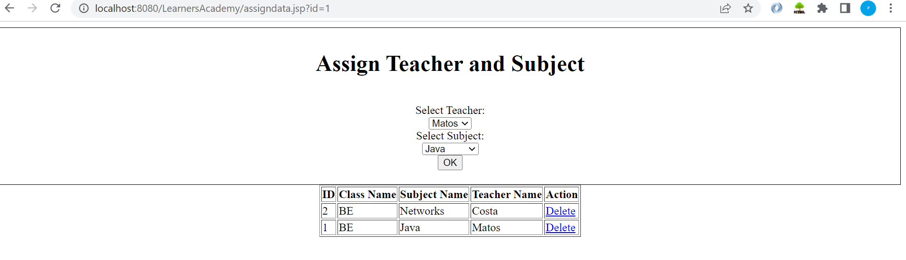
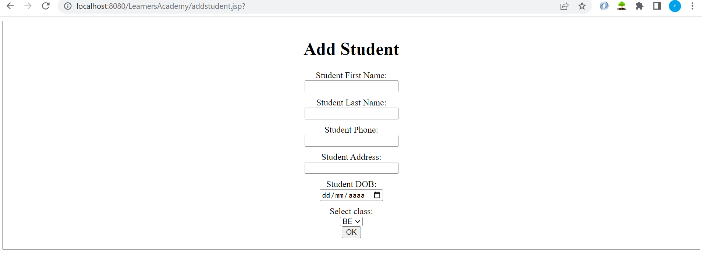
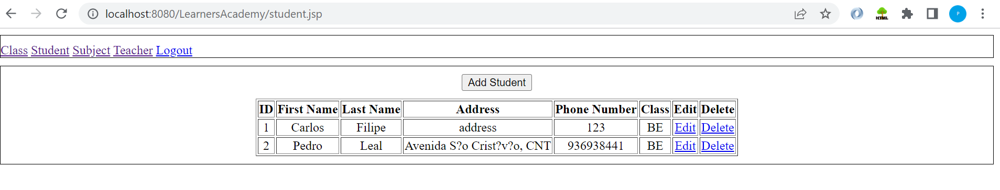

# Administrative-portal-for-Learner-s-Academy
## Project' Details
This project aims to design and develop a backend administrative portal for the Learner’s Academy using Java EE technologies. I developed it as a project of phase 2 for the Become a back-end expert course.
The goal of this project is to apply servlet, jsp and Hibernate concepts.

## Product Backlog:
1.	Create POJO and DAO object to manipulate data.
2.	Create configuration file to access database.
3.	Create DButil to get session from hibernte.
4.	Create a database utility class to retrieve data.
5.	Create login page.
6.	Create JSP files.
7.	Create a servlet to get requests and send responses to the JSP files.
9.	Create a CSS file to format the contents.
10.	Debug and Test the project.

## Technologies and tools Used
•	Servlet: to do the business logic and works a controller for the project. 

•	JSP: to handle the presentation view.

•	SQL: to create and manage the database.

•	Hibernate: to map objects and make operations on the database for the project.

•	CSS: to format the contents.

•	Workbench: to administrate and manage the database manually.

•	Eclipse: to write and run the code.

•	Tomcat: to run and deploy servlet application.

## Flowcharts of The Application

## Core concepts used in the project. 

*	Object-Oriented: used to create and model objects for users and their credentials.

*	Data Access Object: used to store and retrieve data. 

*	Data Sources: used to define a set of properties required to identify and access the database

*	Collections: used some collections such arraylist to store collection of data. 

* JSP Implicit Objects:
  *	Include: to reuse navigation bar in multiple screens
  *	Request: to get parameters from calling page
  *	Response: to redirect to another page
  *	Out: to write content in page
  *	ORM: reduced the hassle of creating tables, converts POJO into SQL Table, no need write SQL in code.

## How to run the program
•	clone project

•	Go to “src\main\java\hibernate.cfg.xml” file and open it.

•	Edit the database’ properties such as username, password and driverClassName to be suit to your database administration tool.

•	Now run program on a server.

•	Go to server/login.jsp.

•	To login you must enter root for username and user for password.

## Screenshots:

